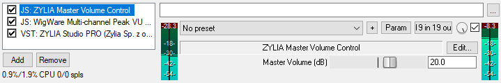

# ZYLIA Master Volume Control

Copyright (c) 2018 Zylia Sp. z o.o.  
License: LGPL - http://www.gnu.org/licenses/lgpl.html  
Author: Tomasz Żernicki  

ZYLIA Master Volume Control is a JSFX plugin dedicated for ZYLIA ZM-1 devices.
Main feature is volume adjustment of 19-channel recordings in the range +/- 70 dB.

### Installation
1. Open REAPER
2. Click on *Options* and choose *Show REAPER resource path in explorer/finder*
3. Copy ZYLIA Master Volume Control plugin to the *Effects* folder
4. Open REAPER -> Options -> Preferences -> Plug-ins -> VST and click on Re-scan button

You can also refer to this tutorial https://www.youtube.com/watch?v=9EegrN-gF5o

### Usage
In REAPER create the following FX chain:
* ZYLIA Master Volume Control
* multi-channel level meter
* ZYLIA Studio PRO or ZYLIA Ambisonics Converter plugin

To monitor volume changes we recommend multi-channel level meters such as:
* [WigWare Multi-Channel VU Meter](http://www.brucewiggins.co.uk/wp-content/uploads/2016/04/WigMCVUMeter.zip) by Bruce Wiggins
* [mcfx_meter](http://www.matthiaskronlachner.com/?p=1910) by Matthias Kronlachner

